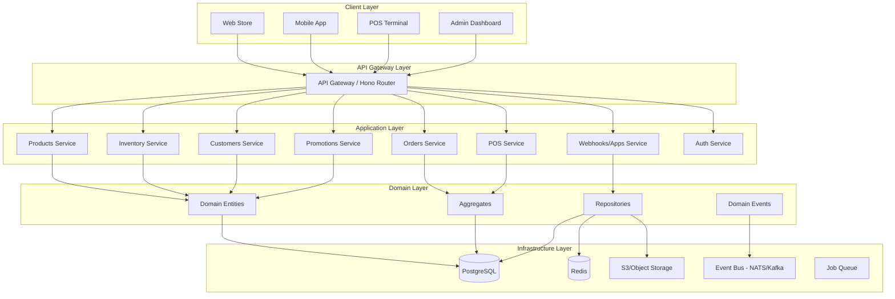

# 🏗️ Backend E-commerce + POS — Architecture Overview

## 🎯 Product Vision

A **headless, API-first e-commerce platform** with integrated POS capabilities, similar to:
- Shopify
- Medusa.js
- Saleor
- CommerceTools

## 🧱 High-Level Architecture



## 🎨 Architecture Pattern

**Modular Monolith** with Domain-Driven Design (DDD)

- **Modular**: Clear bounded contexts per business domain
- **Monolith**: Single deployable unit (can evolve to microservices later)
- **DDD**: Entities, Aggregates, Value Objects, Repositories, Domain Services
- **Clean Architecture**: Dependencies point inward
- **Event-Driven**: Async communication via event bus

## 🧩 Core Modules

| Module | Responsibility | Key Entities |
|--------|---------------|--------------|
| **Products** | Catalog management | Product, Variant, Collection, Attribute |
| **Inventory** | Stock tracking | Warehouse, StockLevel, StockMovement |
| **Orders** | Order lifecycle | Cart, Order, OrderItem, Payment |
| **Customers** | Customer management | Customer, Address, AuthToken |
| **POS** | Point of Sale | POSSession, POSCart, POSPayment |
| **Promotions** | Discounts & coupons | Coupon, Discount, PromotionRule |
| **Webhooks/Apps** | Extensions & integrations | App, Webhook, Event |
| **Auth** | Authentication & authorization | User, Role, Permission |

## 🔐 Authentication & Authorization

### Roles
- `ADMIN`: Full access
- `STAFF`: Store management
- `POS_OPERATOR`: POS terminal access
- `CUSTOMER`: Storefront access

### Authentication Flow
```
1. User login → JWT access token (15min) + refresh token (7d)
2. Token validation via middleware
3. RBAC check per route
4. Token refresh endpoint
```

## 📡 Event-Driven Architecture

### Event Bus (NATS Streaming)
```
product.created
product.updated
inventory.stock.reserved
order.created
order.paid
order.fulfilled
pos.session.opened
pos.sale.completed
customer.registered
webhook.triggered
```

### Event Flow Example: Order Creation
```
1. POST /api/orders → Order created
2. Emit: order.created
3. Inventory Service: Reserve stock
4. Promotions Service: Apply discounts
5. Webhooks Service: Trigger webhooks
6. Email Service: Send confirmation
```

## 🗄️ Database Strategy

- **PostgreSQL**: Primary transactional database
- **Redis**: Caching, sessions, rate limiting
- **S3**: Media storage (images, documents)
- **NATS/Kafka**: Event streaming

## 🚀 Technology Stack

### Runtime & Framework
- **Node.js** (v20+)
- **Hono** (modern, fast web framework)
- **TypeScript** (strict mode)

### Database & Storage
- **PostgreSQL** (with Drizzle ORM)
- **Redis** (ioredis)
- **S3-compatible storage** (MinIO or AWS S3)

### Event Bus
- **NATS** or **Redis Streams** (lightweight option)

### Validation & Security
- **Zod** (runtime validation)
- **JWT** (jsonwebtoken)
- **bcrypt** (password hashing)

### Testing
- **Vitest** (unit tests)
- **Supertest** (API tests)
- **Testcontainers** (integration tests)

### DevOps
- **Docker** & **Docker Compose**
- **GitHub Actions** (CI/CD)
- **Nginx** (reverse proxy)

## 📦 Folder Structure

```
backend-ecommerce-pos/
├── src/
│   ├── modules/              # Business modules
│   │   ├── products/
│   │   ├── inventory/
│   │   ├── orders/
│   │   ├── customers/
│   │   ├── pos/
│   │   ├── promotions/
│   │   ├── webhooks/
│   │   └── auth/
│   ├── core/                 # Core domain patterns
│   │   ├── domain/           # Base entities, value objects
│   │   ├── application/      # Use cases, DTOs
│   │   └── infrastructure/   # Database, event bus, storage
│   ├── shared/               # Shared utilities
│   │   ├── middleware/
│   │   ├── validation/
│   │   ├── errors/
│   │   └── utils/
│   ├── api/                  # HTTP layer
│   │   ├── routes/
│   │   └── middleware/
│   └── main.ts               # App entry point
├── tests/
│   ├── unit/
│   ├── integration/
│   └── e2e/
├── migrations/               # Database migrations
├── docs/                     # API docs, guides
├── scripts/                  # Utility scripts
├── docker/
│   ├── Dockerfile
│   └── docker-compose.yml
├── .env.example
├── package.json
├── tsconfig.json
└── README.md
```

## 🔄 Development Workflow

1. **Local Development**: Docker Compose (Postgres, Redis, NATS)
2. **Hot Reload**: tsx watch mode
3. **Testing**: Vitest + Testcontainers
4. **Linting**: ESLint + Prettier
5. **Type Safety**: TypeScript strict mode
6. **API Docs**: OpenAPI/Swagger

## 📈 Scalability Considerations

- **Horizontal scaling**: Stateless services
- **Caching**: Redis for hot data
- **Database connection pooling**: PgBouncer
- **Job queue**: Bull/BullMQ for async tasks
- **CDN**: For static assets
- **Event sourcing**: Optional for audit trail

## 🛡️ Security Best Practices

- JWT with short expiry + refresh tokens
- Password hashing with bcrypt (cost 12)
- Input validation with Zod
- SQL injection protection (parameterized queries)
- Rate limiting (express-rate-limit or Redis)
- CORS configuration
- Helmet for HTTP headers
- HTTPS only in production

## 📊 Monitoring & Observability

- **Logging**: Winston or Pino
- **Metrics**: Prometheus + Grafana
- **Tracing**: OpenTelemetry (optional)
- **Health checks**: /health endpoint
- **Error tracking**: Sentry (optional)

---

## 🚦 Next Steps

1. ✅ Review architecture
2. ⏳ Generate folder structure
3. ⏳ Create database schema
4. ⏳ Implement core modules
5. ⏳ Build API endpoints
6. ⏳ Setup event system
7. ⏳ Write tests
8. ⏳ Setup Docker & CI/CD
