# 🗄️ Database Schema — E-commerce + POS

## Entity Relationship Diagram

```mermaid
erDiagram
    %% Products Domain
    PRODUCTS ||--o{ VARIANTS : has
    PRODUCTS ||--o{ PRODUCT_IMAGES : has
    PRODUCTS }o--o{ COLLECTIONS : belongs_to
    PRODUCTS }o--o{ ATTRIBUTES : has
    VARIANTS ||--o{ VARIANT_ATTRIBUTES : has

    %% Inventory Domain
    VARIANTS ||--o{ STOCK_LEVELS : tracked_in
    WAREHOUSES ||--o{ STOCK_LEVELS : contains
    STOCK_LEVELS ||--o{ STOCK_MOVEMENTS : generates

    %% Orders Domain
    CUSTOMERS ||--o{ ORDERS : places
    ORDERS ||--o{ ORDER_ITEMS : contains
    ORDERS ||--o{ PAYMENTS : has
    ORDERS ||--o{ FULFILLMENTS : has
    VARIANTS }o--|| ORDER_ITEMS : references

    %% POS Domain
    POS_SESSIONS ||--o{ POS_SALES : contains
    POS_SALES ||--o{ POS_SALE_ITEMS : has
    VARIANTS }o--|| POS_SALE_ITEMS : references

    %% Customers Domain
    CUSTOMERS ||--o{ ADDRESSES : has
    CUSTOMERS ||--o{ CUSTOMER_TAGS : tagged

    %% Promotions Domain
    COUPONS }o--o{ ORDERS : applied_to
    DISCOUNTS }o--o{ PRODUCTS : applies_to
    DISCOUNTS }o--o{ COLLECTIONS : applies_to

    %% Auth Domain
    USERS ||--o{ USER_ROLES : has
    ROLES ||--o{ USER_ROLES : assigned_to
    ROLES ||--o{ ROLE_PERMISSIONS : has
    PERMISSIONS ||--o{ ROLE_PERMISSIONS : granted_by

    %% Webhooks Domain
    APPS ||--o{ WEBHOOKS : subscribes_to
    WEBHOOKS ||--o{ WEBHOOK_DELIVERIES : triggers

    %% Products
    PRODUCTS {
        uuid id PK
        string handle UK
        string title
        text description
        string status
        string vendor
        string product_type
        jsonb metadata
        timestamp created_at
        timestamp updated_at
    }

    VARIANTS {
        uuid id PK
        uuid product_id FK
        string sku UK
        string barcode UK
        string title
        decimal price
        decimal compare_at_price
        decimal cost_per_item
        boolean taxable
        integer weight_value
        string weight_unit
        boolean requires_shipping
        jsonb metadata
        timestamp created_at
        timestamp updated_at
    }

    PRODUCT_IMAGES {
        uuid id PK
        uuid product_id FK
        uuid variant_id FK
        string url
        string alt_text
        integer position
        timestamp created_at
    }

    COLLECTIONS {
        uuid id PK
        string handle UK
        string title
        text description
        string sort_order
        jsonb rules
        timestamp created_at
        timestamp updated_at
    }

    PRODUCT_COLLECTIONS {
        uuid product_id FK
        uuid collection_id FK
        integer position
    }

    ATTRIBUTES {
        uuid id PK
        string name UK
        string type
        jsonb values
    }

    VARIANT_ATTRIBUTES {
        uuid variant_id FK
        uuid attribute_id FK
        string value
    }

    %% Inventory
    WAREHOUSES {
        uuid id PK
        string code UK
        string name
        string address
        string city
        string country
        boolean is_active
        timestamp created_at
        timestamp updated_at
    }

    STOCK_LEVELS {
        uuid id PK
        uuid variant_id FK
        uuid warehouse_id FK
        integer available
        integer reserved
        integer incoming
        timestamp updated_at
    }

    STOCK_MOVEMENTS {
        uuid id PK
        uuid variant_id FK
        uuid warehouse_id FK
        string type
        integer quantity
        string reference_type
        uuid reference_id
        text note
        timestamp created_at
    }

    %% Orders
    ORDERS {
        uuid id PK
        string order_number UK
        uuid customer_id FK
        string email
        string status
        string financial_status
        string fulfillment_status
        decimal subtotal
        decimal tax_total
        decimal shipping_total
        decimal discount_total
        decimal total
        string currency
        jsonb shipping_address
        jsonb billing_address
        jsonb metadata
        timestamp created_at
        timestamp updated_at
    }

    ORDER_ITEMS {
        uuid id PK
        uuid order_id FK
        uuid variant_id FK
        string title
        string sku
        integer quantity
        decimal price
        decimal discount_amount
        decimal tax_amount
        decimal total
        jsonb metadata
    }

    PAYMENTS {
        uuid id PK
        uuid order_id FK
        string status
        string provider
        string transaction_id
        decimal amount
        string currency
        string payment_method
        jsonb metadata
        timestamp created_at
    }

    FULFILLMENTS {
        uuid id PK
        uuid order_id FK
        string status
        string tracking_number
        string carrier
        jsonb line_items
        timestamp shipped_at
        timestamp delivered_at
        timestamp created_at
    }

    %% Customers
    CUSTOMERS {
        uuid id PK
        string email UK
        string first_name
        string last_name
        string phone
        boolean accepts_marketing
        string tax_exempt
        jsonb metadata
        timestamp created_at
        timestamp updated_at
    }

    ADDRESSES {
        uuid id PK
        uuid customer_id FK
        string first_name
        string last_name
        string company
        string address1
        string address2
        string city
        string province
        string country
        string zip
        string phone
        boolean is_default
    }

    CUSTOMER_TAGS {
        uuid customer_id FK
        string tag
    }

    %% POS
    POS_SESSIONS {
        uuid id PK
        string session_number UK
        uuid user_id FK
        uuid warehouse_id FK
        string status
        decimal opening_cash
        decimal closing_cash
        timestamp opened_at
        timestamp closed_at
        jsonb metadata
    }

    POS_SALES {
        uuid id PK
        string sale_number UK
        uuid session_id FK
        uuid customer_id FK
        string status
        decimal subtotal
        decimal tax_total
        decimal discount_total
        decimal total
        string payment_method
        jsonb metadata
        timestamp created_at
    }

    POS_SALE_ITEMS {
        uuid id PK
        uuid sale_id FK
        uuid variant_id FK
        string title
        string sku
        integer quantity
        decimal price
        decimal discount_amount
        decimal total
    }

    %% Promotions
    COUPONS {
        uuid id PK
        string code UK
        string type
        decimal value
        decimal min_purchase_amount
        integer usage_limit
        integer times_used
        timestamp starts_at
        timestamp ends_at
        boolean is_active
        timestamp created_at
    }

    DISCOUNTS {
        uuid id PK
        string title
        string type
        decimal value
        string target_type
        string target_selection
        string allocation_method
        timestamp starts_at
        timestamp ends_at
        boolean is_active
        jsonb conditions
        timestamp created_at
    }

    DISCOUNT_PRODUCTS {
        uuid discount_id FK
        uuid product_id FK
    }

    DISCOUNT_COLLECTIONS {
        uuid discount_id FK
        uuid collection_id FK
    }

    %% Auth
    USERS {
        uuid id PK
        string email UK
        string password_hash
        string first_name
        string last_name
        boolean is_active
        timestamp last_login_at
        timestamp created_at
        timestamp updated_at
    }

    ROLES {
        uuid id PK
        string name UK
        string description
        timestamp created_at
    }

    PERMISSIONS {
        uuid id PK
        string name UK
        string resource
        string action
        timestamp created_at
    }

    USER_ROLES {
        uuid user_id FK
        uuid role_id FK
    }

    ROLE_PERMISSIONS {
        uuid role_id FK
        uuid permission_id FK
    }

    REFRESH_TOKENS {
        uuid id PK
        uuid user_id FK
        string token UK
        timestamp expires_at
        timestamp created_at
    }

    %% Webhooks
    APPS {
        uuid id PK
        string name
        string api_key UK
        string api_secret_hash
        string callback_url
        jsonb scopes
        boolean is_active
        timestamp created_at
    }

    WEBHOOKS {
        uuid id PK
        uuid app_id FK
        string topic
        string url
        string format
        boolean is_active
        timestamp created_at
    }

    WEBHOOK_DELIVERIES {
        uuid id PK
        uuid webhook_id FK
        string event_id
        string topic
        jsonb payload
        integer status_code
        text response_body
        integer attempt
        timestamp delivered_at
    }
```



## Indexes Strategy

```sql
-- Products
CREATE INDEX idx_products_handle ON products(handle);
CREATE INDEX idx_products_status ON products(status);
CREATE INDEX idx_products_vendor ON products(vendor);
CREATE INDEX idx_variants_product_id ON variants(product_id);
CREATE INDEX idx_variants_sku ON variants(sku);
CREATE INDEX idx_variants_barcode ON variants(barcode);

-- Inventory
CREATE INDEX idx_stock_levels_variant_warehouse ON stock_levels(variant_id, warehouse_id);
CREATE INDEX idx_stock_movements_variant_id ON stock_movements(variant_id);
CREATE INDEX idx_stock_movements_warehouse_id ON stock_movements(warehouse_id);
CREATE INDEX idx_stock_movements_created_at ON stock_movements(created_at DESC);

-- Orders
CREATE INDEX idx_orders_customer_id ON orders(customer_id);
CREATE INDEX idx_orders_status ON orders(status);
CREATE INDEX idx_orders_created_at ON orders(created_at DESC);
CREATE INDEX idx_order_items_order_id ON order_items(order_id);
CREATE INDEX idx_order_items_variant_id ON order_items(variant_id);

-- Customers
CREATE INDEX idx_customers_email ON customers(email);
CREATE INDEX idx_addresses_customer_id ON addresses(customer_id);

-- POS
CREATE INDEX idx_pos_sessions_user_id ON pos_sessions(user_id);
CREATE INDEX idx_pos_sessions_opened_at ON pos_sessions(opened_at DESC);
CREATE INDEX idx_pos_sales_session_id ON pos_sales(session_id);
CREATE INDEX idx_pos_sales_created_at ON pos_sales(created_at DESC);

-- Auth
CREATE INDEX idx_users_email ON users(email);
CREATE INDEX idx_refresh_tokens_token ON refresh_tokens(token);
CREATE INDEX idx_refresh_tokens_user_id ON refresh_tokens(user_id);

-- Webhooks
CREATE INDEX idx_webhooks_app_id ON webhooks(app_id);
CREATE INDEX idx_webhook_deliveries_webhook_id ON webhook_deliveries(webhook_id);
CREATE INDEX idx_webhook_deliveries_delivered_at ON webhook_deliveries(delivered_at DESC);
```

## Key Constraints

- All tables use `uuid` as primary key
- Soft deletes via `deleted_at` timestamp where needed
- `created_at` and `updated_at` timestamps on mutable entities
- Foreign keys with `ON DELETE CASCADE` or `ON DELETE SET NULL`
- Unique constraints on business keys (email, sku, barcode, handle, code)
- Check constraints for enum fields (status, type, etc.)
