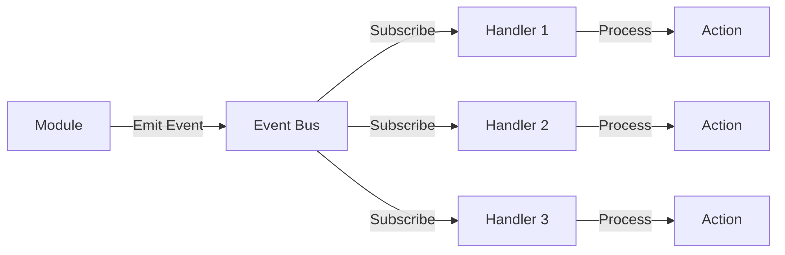

# 📡 Event System Documentation

## Event Bus Architecture

The system uses **NATS Streaming** as the event bus for asynchronous, event-driven communication between modules.

## Event Flow



## Event Format

All events follow this structure:

```typescript
{
  eventId: string;        // Unique event ID
  eventType: string;      // Event type (e.g., "product.created")
  aggregateId: string;    // ID of the aggregate that triggered the event
  occurredAt: string;     // ISO 8601 timestamp
  data: {                 // Event-specific payload
    // ...
  }
}
```

## Event Topics

### Products

| Topic | Description | Payload |
|-------|-------------|---------|
| `product.created` | Product was created | `{ productId, handle, title, status }` |
| `product.updated` | Product was updated | `{ productId, changes }` |
| `product.deleted` | Product was deleted | `{ productId }` |
| `product.variant.added` | Variant added to product | `{ productId, variantId, sku }` |

### Inventory

| Topic | Description | Payload |
|-------|-------------|---------|
| `inventory.stock.adjusted` | Stock level manually adjusted | `{ variantId, warehouseId, oldLevel, newLevel }` |
| `inventory.stock.reserved` | Stock reserved for order | `{ variantId, warehouseId, quantity, orderId }` |
| `inventory.stock.released` | Reserved stock released | `{ variantId, warehouseId, quantity, orderId }` |
| `inventory.stock.low` | Stock below threshold | `{ variantId, warehouseId, currentLevel, threshold }` |

### Orders

| Topic | Description | Payload |
|-------|-------------|---------|
| `order.created` | Order created | `{ orderId, orderNumber, customerId, total }` |
| `order.paid` | Payment received | `{ orderId, paymentId, amount }` |
| `order.fulfilled` | Order fulfilled | `{ orderId, fulfillmentId }` |
| `order.cancelled` | Order cancelled | `{ orderId, reason }` |
| `order.refunded` | Order refunded | `{ orderId, refundId, amount }` |

### Customers

| Topic | Description | Payload |
|-------|-------------|---------|
| `customer.registered` | New customer registered | `{ customerId, email }` |
| `customer.updated` | Customer profile updated | `{ customerId, changes }` |

### POS

| Topic | Description | Payload |
|-------|-------------|---------|
| `pos.session.opened` | POS session opened | `{ sessionId, userId, warehouseId, openingCash }` |
| `pos.session.closed` | POS session closed | `{ sessionId, closingCash, totalSales }` |
| `pos.sale.completed` | Sale completed | `{ saleId, sessionId, total, items }` |
| `pos.sale.refunded` | Sale refunded | `{ saleId, refundAmount }` |

### Webhooks

| Topic | Description | Payload |
|-------|-------------|---------|
| `webhook.triggered` | Webhook was triggered | `{ webhookId, topic, payload }` |
| `webhook.delivered` | Webhook successfully delivered | `{ webhookId, deliveryId, statusCode }` |
| `webhook.failed` | Webhook delivery failed | `{ webhookId, deliveryId, error }` |

## Event Handlers

### Example: Stock Reservation on Order Creation

```typescript
eventBus.subscribe('order.created', async (event) => {
  const { orderId, items } = event.data;

  for (const item of items) {
    await inventoryService.reserveStock({
      variantId: item.variantId,
      quantity: item.quantity,
      orderId,
    });
  }
});
```

### Example: Send Email on Order Paid

```typescript
eventBus.subscribe('order.paid', async (event) => {
  const { orderId, customerId } = event.data;

  await emailService.sendOrderConfirmation({
    orderId,
    customerId,
  });
});
```

## Event Publishing

### From Domain Entities

```typescript
class Product extends AggregateRoot {
  static create(props) {
    const product = new Product(props);

    // Add domain event
    product.addDomainEvent(
      new ProductCreatedEvent(product.id, props)
    );

    return product;
  }
}
```

### From Application Services

```typescript
class ProductService {
  async createProduct(input) {
    const product = Product.create(input);
    await this.repository.save(product);

    // Publish domain events
    for (const event of product.domainEvents) {
      await eventBus.publish(`product.${event.eventType}`, event);
    }

    product.clearEvents();
    return product;
  }
}
```

## Event Patterns

### Command Pattern

```
Client → Command → Command Handler → Domain → Events → Event Handlers
```

### Saga Pattern (Future)

For complex workflows spanning multiple modules:

```
Order Created → Reserve Stock → Process Payment → Fulfill Order
     ↓              ↓                 ↓                ↓
  Success       Success           Success         Complete
     ↓              ↓                 ↓                ↓
     ✓              ✓                 ✓                ✓
```

If any step fails, compensating transactions are triggered.

## Event Replay

Events are stored in NATS Streaming and can be replayed for:
- Debugging
- Rebuilding read models
- Event sourcing (future)

## Best Practices

1. **Idempotency**: Event handlers should be idempotent
2. **Error Handling**: Use dead letter queues for failed events
3. **Versioning**: Include event version in payload
4. **Naming**: Use clear, past-tense event names
5. **Payload**: Keep payloads small and focused
